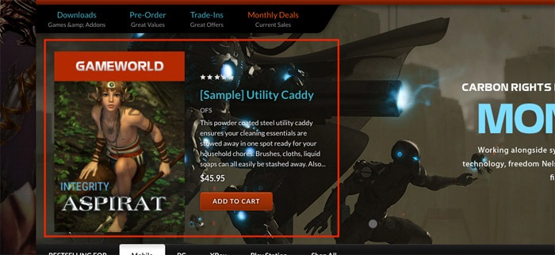

# Customization

This page will explain all configuration available and how to edit each section appear on theme. Let's view the first homepage.


## Top Banner


The top banner can be showed / edited in admin page > __Marketing__ > __Banners__. When you add / edit remember to choose __Location__ is __Top of Page__.

### Colors Customization

To customize colors of this section, go to admin page > __Storefront Design__ > __My Themes__, click button __Customize__ of the current theme to open the Theme Editor. 


Look into the options showing below:


## Header

### Header Styles
This theme support 2 different header styles:
- Logo at left
- Logo at right


To configure, open the __Theme Editor__, scroll down to section __Logo__, click to expand the logo options. Choose a certain option of __Logo position__, then click __Refresh__ button appear after.


### Edit top header text


Edit content in the language file, from admin page > __Storefront Design__ > __My Themes__, click button __Advanced__ > __Edit Theme Files__ of the current theme:


From the left navigation, click to edit the language file (e.i `en.json`):


Edit the text as figured above.


### Colors Customization

To customize colors of the header section, look into the options showing below in the Theme Editor:


## Main Slideshow / Carousel


### Edit the slideshow

Edit the slideshow in admin page > __Storefront Design__ > __Design Options__:


### Colors Customization

To customize color of the slideshow's elements, look into section __Carousel__ in the Theme Editor:


### Hide the slideshow

To hide the slideshow on homepage, uncheck on the checkbox __Show Carousel__ in section __Carousel__ of the Theme Editor.


### Edit custom links


For editing these links, edit the language file `en.json`, find keys `emthemesmodez` > `home_carousel_links`:


- `heading*`: is the heading text. Live this value a single space character if you want to hide this link.
- `text*`: is the sub-heading text.
- `url*`: is the link URL.


### Products display on the main slideshow



By default, products displaying on the main carousel are __featured products__. It is easy to change to __new products__ or __bestselling products__ or even hide it completely.

Edit the template file `templates/components/carousel.html` the file editor:


To display __new products__, change the text `products.featured` to `products.new`.

To display __bestselling products__, change the text `products.featured` to `products.top`.

If you don't want to display these products. Just delete the code:

```
<div class="emthemesModez-heroCarousel-product">
    {{#each ../products.featured}}
        {{#if @index '==' @../index}}
            {{>components/products/list-item 
                show_rating=../../../settings.show_product_rating
                theme_settings=../../../theme_settings 
                customer=../../../customer}}
        {{/if}}
    {{/each}}
</div>
```


## Products by Categories Tabs


This section lets you show products by category, Each tab is a sub-category, tab content contains products in corresponding sub-categories. It show products immediately when click on a tab without leaving page.

You can show up to 3 sections of this section type. You can show root category or any sub-category as well.


### Configure Category ID and Text

To edit category ID and text, edit the the language file `en.json`, find keys `emthemesmodez` > `products_by_category_subcategories_tabs`:


- `heading`: is the main heading if specific category is root category.
- `view_all`: is 'view all' link label.
- `category_1`, `category_2`, `category_3`: is category ID of section instance 1st, 2nd and 3rd. You can display up to 3 instances of this section. Value `0` specifies category is root category.


### Colors Customization

You can customize colors in Theme Editor, __Homepage__ section as showing below:


## Products by Categories Columns


This section let you show products in a specific category in each column. You can show this sections up to 3 times with different categories.

### Configure Category IDs and sorting order

To specify categories, edit the language file `en.json`, find keys `emthemesmodez` > `products_by_category_columns`, there are 3 groups `instance1`, `instance2`, `instance3` represent 3 sections can display:


- `category_1`, `category_2`, `category_3`: is category ID of products in column 1, 2, 3.
- `sort_by`: is products sorting order. Supports value `newest`, `featured`, `bestselling`.


### Colors Customization

You can customize colors in Theme Editor, __Homepage__ section as showing below:


## New / Featured / Popular Products

The theme supports 4 layout type of __New Products__, __Featured Products__ and __Popular Products__ blocks:

__Grid__:


__Carousel__:


### Configure a Layout Type of products block & Number of Products to show up

In the __Theme Editor__ > __Homepage__, look into __New Products__ section (or __Featured Products__, __Most Popular Products__):

- __Display type__: Choose appropriate layout type (__Grid__, __Carousel__).
- __Number of Products__: Choose number of products to show up.


### Show/Hide Quickview button

When hover on a product item, Quickview button is showed up by default. To disable this feature, uncheck the checkbox __Show Quickview__ in the __Theme Editor__ > __Products__ section.


### Change colors and image sizes

In the __Theme Editor__ > __Products__ section, Look into the color options below __Product cards__, __Product Sale Badges__, __Product cards (Quick search)__ and __Image sizes__'s options.


### Change the heading text

To change the heading text (New Products, Featured Products, Most Popular Products), edit the language file, look for the key `products` > `new` or `featured` or `top`.


## Image Banners

Theme supports many banner styles:


### Banners Game Platform 1


To edit these banners, edit the language file `en.json`, find keys `emthemesmodez` > `banners` > `game_platform_1`:


If you require complex customization, just edit template file `templates/components/emthemes-modez/banners/game-platform1.html`.


### Banners Game Platform 2


If you require complex customization, just edit template file `templates/components/emthemes-modez/banners/game-platform2.html`.


### Fullwidth Banner


Support displaying up to 5 fullwidth banners on homepage.

To edit these banners, edit the language file `en.json`, find keys `emthemesmodez` > `banners` > `one_1` to `one_5` represent 5 fullwidth banners accordingly.


- `title`: is banner title text. Leave a single space character to hide it.
- `text`: is description text. Leave a single space character to hide it.
- `button`: is button text. Leave a single space character to hide it.
- `image`: is banner image URL.
- `url`: is banner link.


### 2 Half Banners


Support displaying up to 5 half-size banners on homepage.

To edit these banners, edit the language file `en.json`, find keys `emthemesmodez` > `banners` > `half_1` to `half_5` represent 5 fullwidth banners accordingly.


### 2/3 & 1/3 Banners


Support displaying up to 5 half-size banners on homepage.

To edit these banners, edit the language file `en.json`, find keys `emthemesmodez` > `banners` > `twothird_onethird_1` to `twothird_onethird_5` represent 5 fullwidth banners accordingly.


### 3 Banners


Support displaying up to 5 half-size banners on homepage.

To edit these banners, edit the language file `en.json`, find keys `emthemesmodez` > `banners` > `onethird_x3_1` to `onethird_x3_5` represent 5 fullwidth banners accordingly.


## Image Carousel


To edit image and links in this image carousel section, edit the language file, find key `emthemesmodez` > `image_carousel`


- `image*`: is link to the image.
- `title*`: is image text description.
- `url*`: is image link. Leave a single space letter in the value if you want to hide any image.


## Footer - Recent Blog Posts


This block show the most recent blog posts.

### Customize heading text and other text

To change the heading text, read more text and date format, edit the language file. Find the key `blog` > `recent_posts`, `posted_by` and `read_more`, edit its values as you want.


### Show/Hide & Configure number of posts

To show/hide or configure number of posts to display, open __Theme Editor__ > __Footer__ section > select value of __Show recent blog__.


## Footer - Custom Links


To edit text and links in this footer section, edit the language file, find keys `footer`, 4 keys `links_col_1`, `links_col_2`, `links_col_3`, `links_col_4` represent 4 link columns:


- `heading`: is heading title in each column.
- `title`: is link label. Leave a single space character to hide this link.
- `url`: is link URL.


You can show or hide any custom links group in __Theme Editor__ > __Footer__ section:


## Footer - Page Links


This section will show all our page links. To change the heading text __Navigate__, edit the language file `en.json`, find key `footer` > `navigate`, change this key value:


You can configure to show or hide, number of page links to show in __Theme Editor__ > __Footer__ section:


## Footer - Category Links


Edit heading text __Categories__ in the language file `en.json`, find key `footer` > `categories`:


You can configure to show or hide, number of categories to show in __Theme Editor__ > __Footer__ section:


## Footer - Contact Info


Edit heading text __Contact Info__ in the language file `en.json`, find key `footer` > `info`:


- `call_us`: is the translation text for phone calling number.
- `email`: is email to display.

Address can be edited in admin page > __Store Setup__ > __Store Profile__ > __Store Address__.

You can configure to show or hide this section in __Theme Editor__ > __Footer__ section:


## Footer - Newsletter


### Edit text

To edit text in newsletter form, edit the language file `en.json`, find key `newsletter`, edit text in this section:


### Social media icons

Drag and drop social media icons you want to display in admin page > __Storefront Design__ > __Design Options__:


### Show/Hide

You can configure to show or hide this section in __Theme Editor__ > __Footer__ section:


## Footer - Location


Edit heading text __Contact Info__ and the image in the language file `en.json`, find key `footer`, change value of `location` and `location_image`:


You can configure to show or hide this section in __Theme Editor__ > __Footer__ section:


## Footer - Popular Brands


Edit heading text __Popular Brands__ in the language file `en.json`, find key `footer` > `brands`:


You can configure to show or hide this section in __Theme Editor__ > __Footer__ section:


## Footer - Payment Icons


To show/hide payment icons, go to Theme __Editor__ > __Payment Icons__ secitons, check or uncheck any icons you want to show or hide.


## Footer - Credit Links


To show/hide the credit links, go to Theme Editor > __Footer__ section, tick or untick the checkboxes as showing above.


## Edit homepage template

This advanced topic will instruct you how to edit homepage template to customize your homepage, add more sections, delete or rearrange other sections.

To edit the homepage template, open __Edit Theme Files__, find and open file `templates` > `pages` > `home.html`:


Look at the code in `home.html`:

```
{{> components/emthemes-modez/sections/section section="products_by_category_subcategories_tabs_1"}}
{{> components/emthemes-modez/sections/section section="banners_game_platform_1"}}
{{> components/emthemes-modez/sections/section section="banners_game_platform_2"}}
{{> components/emthemes-modez/sections/section section="products_by_category_columns_1"}}
{{> components/emthemes-modez/sections/section section="images_carousel"}}
```

each line represents a section appear on homepage. 

__Section supported:__

- `featured_products`                         : Show featured products. Screenshot: http://prntscr.com/elevep
- `popular_products`                          : Show popular products. Screenshot: http://prntscr.com/elevk2
- `new_products`                              : Show new products. Screenshot: http://prntscr.com/elevqg
- `banner_one_1`                              : Show 1st full width banner. Screenshot: http://prntscr.com/elevyw
- `banner_one_2`                              : Show 2nd full width banner
- `banner_one_3`                              : Show 3rd full width banner
- `banner_one_4`                              : Show 4th full width banner
- `banner_one_5`                              : Show 5th full width banner
- `banner_half_1`                             : Show 1st 2 half banners
- `banner_half_2`                             : Show 2nd 2 half banners
- `banner_half_3`                             : Show 3rd 2 half banners
- `banner_half_4`                             : Show 4th 2 half banners
- `banner_half_5`                             : Show 5th 2 half banners
- `banner_2313_1`                             : Show 1st 2/3 + 1/3 banners
- `banner_2313_2`                             : Show 2nd 2/3 + 1/3 banners
- `banner_2313_3`                             : Show 3rd 2/3 + 1/3 banners
- `banner_2313_4`                             : Show 4th 2/3 + 1/3 banners
- `banner_2313_5`                             : Show 5th 2/3 + 1/3 banners
- `banner_3x_1`                               : Show 1st 3 1/3 banners
- `banner_3x_2`                               : Show 2nd 3 1/3 banners
- `banner_3x_3`                               : Show 3rd 3 1/3 banners
- `banner_3x_4`                               : Show 4th 3 1/3 banners
- `banner_3x_5`                               : Show 5th 3 1/3 banners
- `products_by_category_subcategories_tabs_1` : Show 1st products by a categories with subcategories tabs
- `products_by_category_subcategories_tabs_2` : Show 2nd products by a categories with subcategories tabs
- `products_by_category_subcategories_tabs_3` : Show 3rd products by a categories with subcategories tabs
- `products_by_category_columns_1`            : Show 1st products by a categories in columns
- `products_by_category_columns_2`            : Show 2nd products by a categories in columns
- `products_by_category_columns_3`            : Show 3rd products by a categories in columns
- `images_carousel`                           : Show images carousel. Screenshot: http://prntscr.com/elewn3


You can add or delete any section you want, rerrange by move each line up or down.


## Edit footer template

If you want more control about the footer, you can edit the footer template at `templates` > `components` > `common` > `footer.html`:


